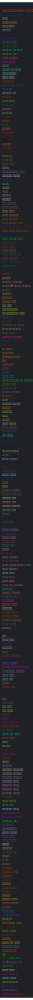

# hindi-color-names

A collection of hindi color names

## call for help

I am the least qualified person to run this repository. 
I am not a native hindi speaker: 
If you are a native hindi speaker and you want to help me, please open an issue 
or a pull request.

I am more then happy to transfer the ownership of this repository to you if you 
are willing to maintain it.

## List of Color Names 🔖 (**252**)



## Building the list

1. Clone the repository
2. Install the dependencies `npm ci`
3. Run the script to generate the list of color names
  
```bash
npm run build
```
